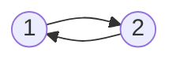
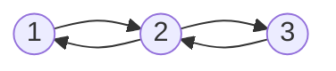
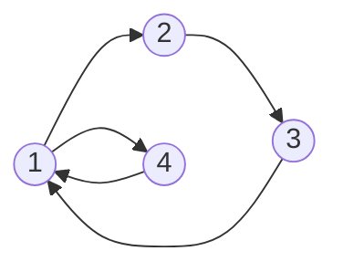
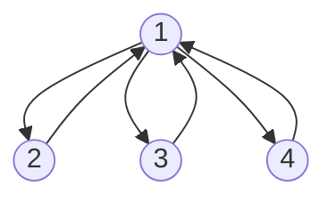
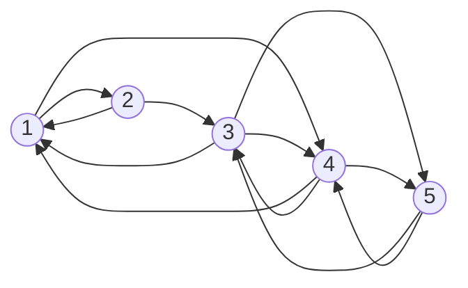

# Cooperative Learning of Bayesian Classifiers

  
  

*** 

Add Description here

## Usage
- `--adj_matrix`: Path to the adjacency matrix to be used
  The script is run with several parameters as shown:
- `--policy`: Either `info` or `recent` 
    - `info`: Selects the list of statistics that holds _more information_ to compute the expectation.
    - `recent`: Selects the _most recent_ list of statistics to compute the expectation.
- `--data`: Path to the dataset in _csv_ format. If not supplied, a dataset is generated with `--n_points`, `--n_variables` and `--dimension`.
- `--n_points`: The number of instances to be generated in the dataset.
- `--n_variables`: Number of variables for the dataset.
- `--dimension`: Cardinality of the categorical variables.
- `--classif_structure`: Either `NB`, `TAN` or `2IBC`
  - `NB`: Learns a Naïve Bayes classifier.
  - `TAN`: Learns a Tree Augmented Naïve Bayes classifier.
  - `2IBC`: Learns a 2 interaction Bayesian classifier.
- `--show`: If 1 plots the network.
- `--exec_sequence`: The execution sequence of the nodes. If not supplied, an execution sequence is randomly generated with `--size`.
- `--size`: Size of the execution sequence if not provided one.
- `--domain_problem`: Either `ParSum` or `parity`.
  - `ParSum`: 
  - `Parity`: 

**Run Example**: `python3 mainAnder.py ---adj_matrix data/network_definitions/adj_4nodes_loop3.txt --policy info --n_points 4000 --n_variables 15 --dimension 2 --dist_prob norm --classif_structure NB --show 1 --exec_sequence 0 3 0 3 1 2 0`

## Supplied Network Designs
The designs can be found in `data/network_definitions`.
- `adj_2nodes.txt`

- `adj_3nodes.txt`

-`adj_4nodes_loop3.txt`

-`adj_ex1.txt`

- `adj_matrix.txt`

--------

## Contact
You can contact the author using the following email:
[Aritz Perez](mailto:aperez@bcamath.org?subject=[CooperativeLearning]%20Information%20About%20Code) or [Ander Carreño](mailto:andercarreno@ehu.eus?subject=[CooperativeLearning]%20Information%20About%20Code) 

